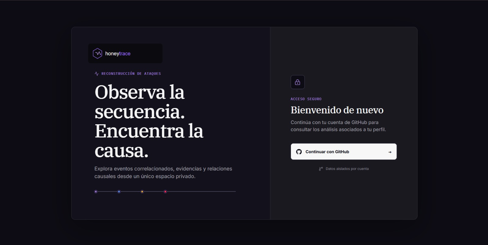
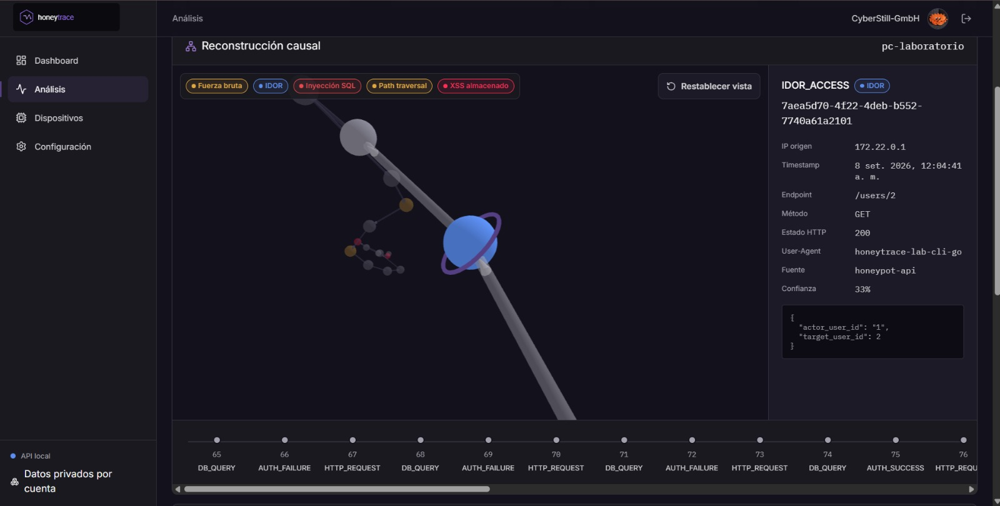
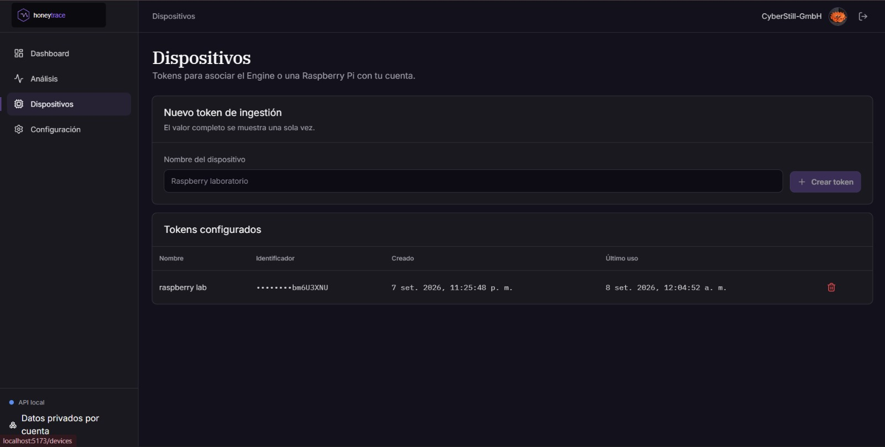

# HoneyTrace

Plataforma académica para desplegar un honeypot controlado, capturar telemetría de ataques y reconstruir causalmente las técnicas observadas sin exponer activos institucionales.

## Proyecto finalizado — UNITEC 2026

HoneyTrace concluyó su alcance académico y fue presentado en la feria **UNITEC 2026**. El repositorio se conserva como evidencia técnica, demostración reproducible y base para posibles extensiones de investigación.

## Equipo

| Integrante | Código académico | Rol |
| --- | --- | --- |
| Cesar Adrian Guevara Salcedo | 20221016A | Líder del proyecto |
| Joel Alexander Ramos Quiroz | 20244624H | Integrante |
| Jhojan Neira Herrera | 20240412F | Integrante |

## Capturas del proyecto

### Acceso privado con GitHub



### Reconstrucción causal interactiva



### Gestión de dispositivos y tokens de ingestión



## Alcance entregado

- [x] Honeypot FastAPI con PostgreSQL 16 y APIs vulnerables contenidas para pruebas autorizadas.
- [x] Captura, normalización y emisión NDJSON de eventos de seguridad.
- [x] Engine determinista en Rust para correlación, reconstrucción por reglas, procedencia y scoring.
- [x] API privada de resultados con Prisma, OAuth de GitHub, estadísticas, filtros, grafo causal y exportación JSON/NDJSON.
- [x] Frontend local en React, Vite y Tailwind con dashboard, historial, dispositivos y Attack Explorer 3D.
- [x] CLI de laboratorio en Go para ejecutar escenarios controlados contra el honeypot.
- [x] Pruebas unitarias, de integración, E2E y contratos de despliegue incluidas en el repositorio.
- [x] Scripts de instalación y arranque automático para Raspberry Pi 4 Model B de 2 GB con SSD SATA externo.
- [x] Demostración final presentada en UNITEC 2026.

La prueba física propuesta en OTI UNI y la validación cuantitativa ampliada contra *ground truth* se archivaron como extensiones de investigación; no se presentan como actividades ejecutadas durante el cierre académico.

## Documentación

- [Cierre del proyecto y evidencia de UNITEC 2026](docs/cierre-unitec-2026.md).
- [Índice general de documentación](docs/README.md).
- [Arquitectura y flujo de datos](docs/arquitectura/arquitectura.md).
- [Roadmap Scrum y cierre](docs/scrum_roadmap.md).
- [Plan de investigación](docs/research_plan.md).
- [Matriz de pruebas](docs/testing/matriz-de-pruebas.md).
- [CLI de laboratorio](scripts/honeytrace-cli/README.md).
- [Instalación en Raspberry Pi](scripts/raspberry-pi/README.md).
- [Plan OTI UNI archivado](docs/oti_uni_test_plan.md).
- [Política de seguridad](SECURITY.md).

## Ejecución local

Cada componente conserva sus instrucciones específicas en su propio README:

- [Honeypot](honeypot/README.md).
- [Pipeline de análisis](pipeline/README.md): separación entre [Collector](pipeline/collector/README.md), [Normalizer](pipeline/normalizer/README.md) y [Correlation Engine](pipeline/engine/README.md).
- [Backend del Visualizer](visualizer/backend/README.md).
- [Frontend del Visualizer](visualizer/frontend/README.md).

Para iniciar únicamente el honeypot:

```powershell
cd C:\projects\HoneyTrace\honeypot
docker compose up -d --build
docker compose ps
```

El backend del honeypot queda disponible en `http://localhost:8000/health`. HoneyTrace contiene vulnerabilidades deliberadas: debe ejecutarse exclusivamente en entornos locales, aislados y autorizados.
