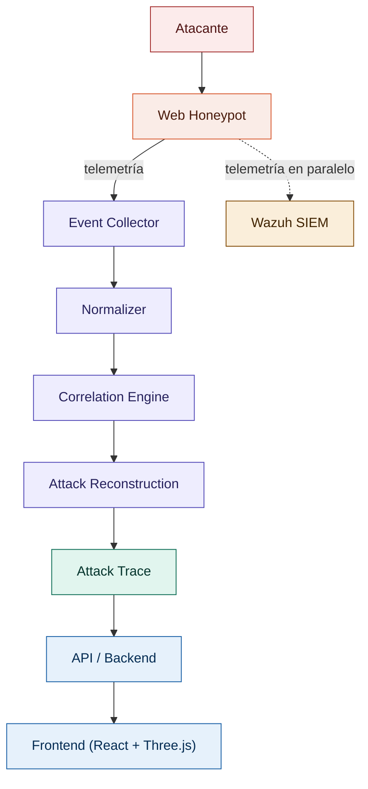

# Arquitectura

## Visión general

HoneyTrace sigue un flujo lineal de procesamiento de telemetría, desde su generación en el honeypot hasta su presentación como una reconstrucción de ataque:

Ver el diagrama ASCII completo en el documento raíz del proyecto y las variantes C4 en `diagramas/`.

## Componentes

### 1. Web Honeypot
Aplicación web deliberadamente vulnerable ejecutada sobre Docker y destinada a la Raspberry Pi. No es objeto de investigación en sí misma; su función es generar interacciones observables. Stack implementado: Python + FastAPI + PostgreSQL.

### 2. Observabilidad / Instrumentación
Capa transversal que expone telemetría desde HTTP, aplicación, base de datos y sistema mediante logging estructurado NDJSON, middleware y hooks propios. OpenTelemetry no forma parte del MVP actual.

### 3. Event Collector
Responsable de capturar, parsear y enviar los eventos crudos. No decide si hay un ataque; es un pipeline de ingesta. Componente adecuado para desarrolladores con menos experiencia.

### 4. Normalizer
Convierte `RawEvent` (formatos heterogéneos según la fuente) a `NormalizedEvent`, según el contrato definido en `/schemas`.

### 5. Correlation Engine
Núcleo técnico del proyecto implementado inicialmente en Rust. Agrupa eventos relacionados usando `trace_id`, sesión, origen, timestamp, ventana temporal y relaciones causales acotadas.

### 6. Attack Reconstruction
A partir de eventos correlacionados, produce un `AttackTrace`: etapas, evidencias, timestamps, relaciones, clasificación y confidence score.

### 7. SIEM (Wazuh)
Recibe telemetría en paralelo al pipeline de HoneyTrace. Sirve como línea base de comparación (detección basada en reglas tradicionales de un SOC).

### 8. API HoneyTrace
Planificada; todavía no existe una implementación TypeScript/Node.js. Cuando se construya, expondrá resultados del Engine sin lógica investigativa propia.

### 9. Frontend
Planificado; React + TypeScript + Three.js sólo se incorporará después de estabilizar pipeline, evaluación y hardware.

## Principios de diseño

- **Separación de responsabilidades por etapa del pipeline**: cada componente hace una sola cosa (capturar, normalizar, correlacionar, reconstruir, exponer, visualizar).
- **El motor (Correlation + Reconstruction) es el núcleo investigativo**; el resto son capas de integración y demostración, y pueden simplificarse o posponerse sin invalidar el proyecto.
- **Reproducibilidad sin hardware**: todo el pipeline de Engine debe poder probarse con fixtures sintéticas en cualquier PC.
- **Ningún componente de UI/API implementa lógica de correlación o reconstrucción.**
- **Todo cambio de stack no trivial se documenta como ADR** (ver `docs/adr/`).

## Diagramas relacionados

- `diagramas/contexto.md` — vista de contexto (actores externos: atacante, equipo, SOC).
- `diagramas/componentes.md` — vista de componentes internos y sus interfaces.
- `diagramas/despliegue.md` — vista de despliegue físico (Raspberry Pi, PCs de desarrollo, red).
