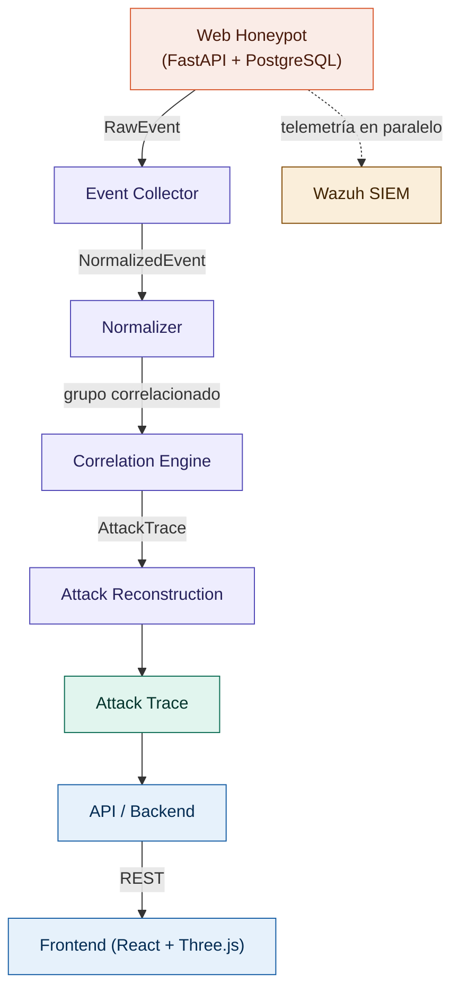

# Diagrama de componentes (C4 - Nivel 2/3)

## Descripción

Vista interna de HoneyTrace, mostrando los componentes definidos en `docs/arquitectura/arquitectura.md` y sus interfaces.

## Interfaces principales

| Origen | Destino | Contrato |
|--------|---------|----------|
| Web Honeypot | Event Collector | Logs estructurados NDJSON |
| Event Collector | Normalizer | `RawEvent` (formato de la fuente) |
| Normalizer | Correlation Engine | `NormalizedEvent` (`/schemas`) |
| Correlation Engine | Attack Reconstruction | Grupo de eventos correlacionados (mismo `correlation_id`) |
| Attack Reconstruction | API | `AttackTrace` (`/schemas`) |
| API | Frontend | REST JSON (`GET /attacks`, `/attacks/:id`, `/events`, `/stats`, `/attacks/:id/graph`) |
| Web Honeypot / Collector | Wazuh | Telemetría en paralelo (agente Wazuh o forwarding de logs) |

## Notas de diseño

- La API no contiene lógica de correlación/reconstrucción; solo lee resultados ya producidos por el Engine.
- El Correlation Engine y Attack Reconstruction pueden probarse de forma aislada usando fixtures de `tests/fixtures/`, sin necesidad del Honeypot ni del Collector reales.
