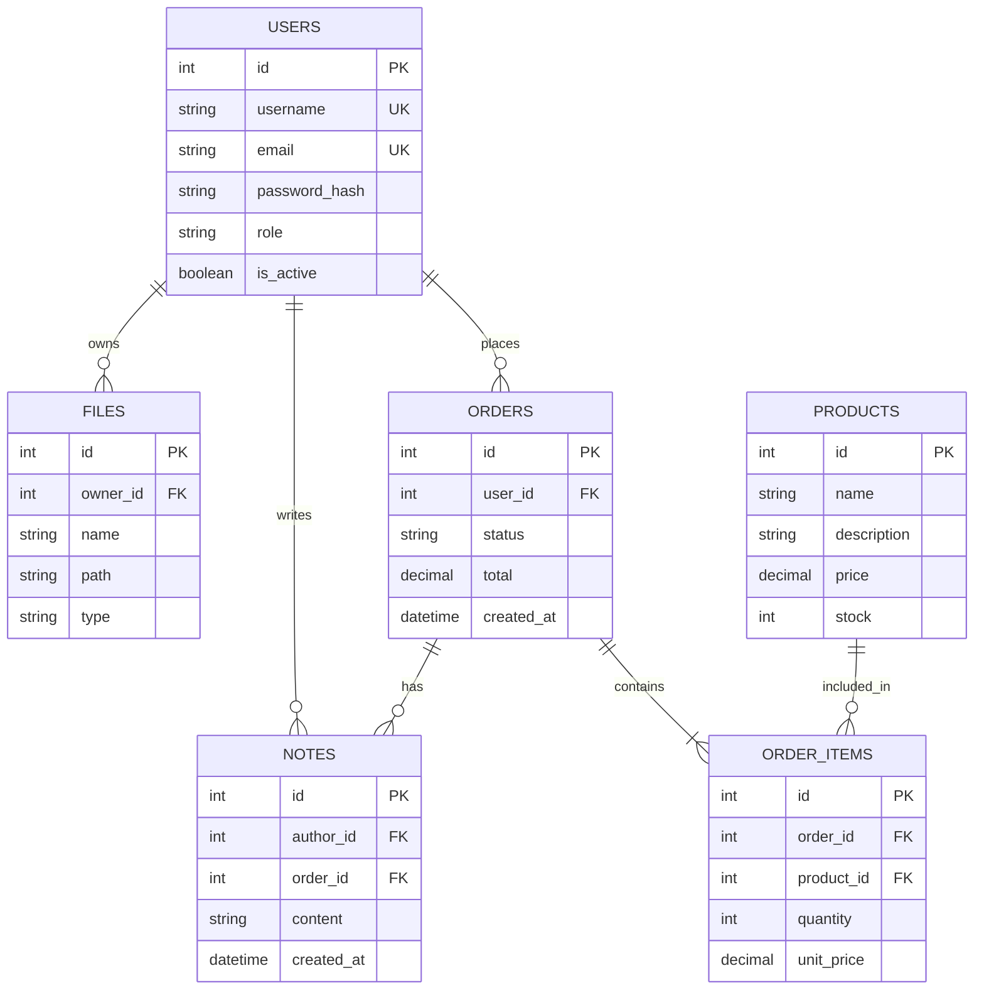

# HoneyTrace Database Architecture

Este documento detalla la arquitectura de base de datos actual para el servicio Honeypot de la plataforma. La base de datos está diseñada relacionalmente utilizando PostgreSQL y gestionada a través de SQLAlchemy (ORM) con Alembic para las migraciones.

## Estado verificado al 21 de agosto de 2026

- [x] PostgreSQL 16 inicia mediante Docker Compose y reporta `healthy`.
- [x] La migración `20260819_0001` está aplicada.
- [x] Existen las seis tablas de dominio y `alembic_version`.
- [x] Claves primarias, cinco claves foráneas y dos restricciones únicas verificadas.
- [x] `alembic check` no detecta diferencias entre modelos y esquema.
- [x] Datos semilla y pruebas de integridad automatizadas en la suite del honeypot.
- [ ] Política de retención y rotación para la prueba en Raspberry Pi/SSD.

## Diagrama Entidad-Relación (ERD)

A continuación se muestra el diagrama de las entidades actuales y sus relaciones:

## Descripción de las Tablas

### `users`
Almacena la información principal de los usuarios y su autenticación.
- **Relaciones**:
  - Un usuario puede tener múltiples archivos (`files`).
  - Un usuario puede realizar múltiples órdenes (`orders`).
  - Un usuario puede escribir múltiples notas (`notes`).

### `files`
Almacena metadatos y rutas de los archivos subidos o relacionados con un usuario.
- **Relaciones**: 
  - Pertenece a un único usuario (`owner`).

### `orders`
Registra las transacciones/órdenes creadas por los usuarios en el sistema.
- **Relaciones**:
  - Pertenece a un único usuario (`user`).
  - Contiene múltiples ítems (`order_items`).
  - Puede tener múltiples notas asociadas (`notes`).

### `order_items`
Es la tabla intermedia que resuelve la relación de muchos-a-muchos entre órdenes y productos, guardando el precio unitario y cantidad al momento de la compra.
- **Relaciones**:
  - Pertenece a una orden (`order`).
  - Hace referencia a un producto (`product`).

### `products`
Catálogo de productos disponibles en el sistema con su respectivo stock.
- **Relaciones**:
  - Puede estar en múltiples ítems de orden (`order_items`).

### `notes`
Permite agregar comentarios o detalles adicionales relacionados a una orden por parte de un usuario.
- **Relaciones**:
  - Escrita por un usuario (`author`).
  - Vinculada a una orden (`order`).

## Consideraciones Técnicas
- **Tipos de Datos**: Uso extensivo de `Mapped` con tipos estrictos (ej. `Numeric(10, 2)` para dinero) asegurando integridad a nivel aplicación y base de datos.
- **Integridad**: Definición de llaves foráneas y borrados/actualizaciones manejadas mediante la configuración de `autoflush` y `expire_on_commit` a nivel de la sesión en `session.py`.
